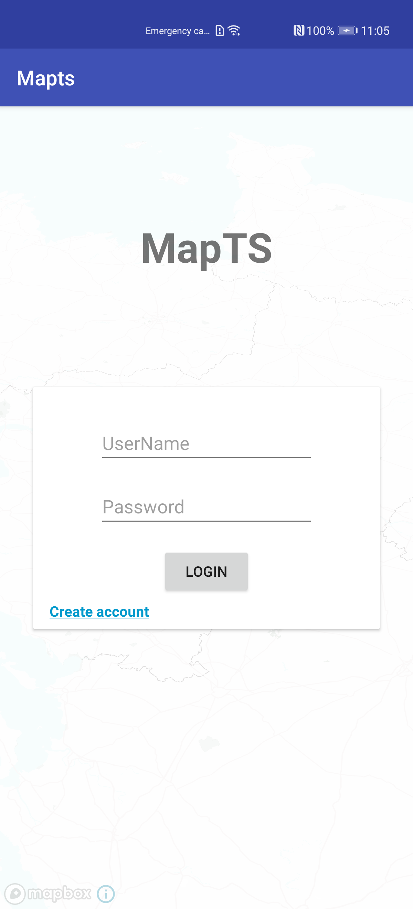

<h3 align="center">
  MAPTS
</h3>

> This is a **Kotlin Multiplatform** small project that implement a login form and map display to test multiplatform project.

You must use [IntellijIDEA](https://www.jetbrains.com/idea/) as the **main IDE**. However,
the **Android client** was developed in [Android Studio](https://developer.android.com/studio/)
and the **iOS client** with [Xcode](https://developer.apple.com/xcode/).

-------

    <a href="#architecture">Architecture</a> &bull;
    <a href="#backend">Backend</a> &bull;
    <a href="#web">Web</a> &bull;
    <a href="#android">Android</a> &bull;
    <a href="#ios">iOS</a>

-------

  

## Info
As opposed to
other cross-platform approaches, Kotlin **doesn't want you to write your code once** and **compile**
it to **multiple platforms**. Instead, it focus on **sharing** the part of the code that
contains **logic** and **left** the **platform specific** part to be implemented **natively**
using its **specific SDK's**.

## Architecture

The **architecture** of this project is composed by one **common module** and its **platform specific** implementations
(jvm, js and ios). A **common-client** module and the **platform specific** modules. One **backend** and three
**clients** (android, ios and web).

<h3 align="center">
  
</h3>

- **common**: Contains all the **common code** shared between the modules. In this case are only the **data** models.
- **common-jvm/js/ios**: Where the **common platform specific** implementations are placed.
- **common-client**: Where the **clients common** code is implemented. Such as the **business** and **presentation**
logic.
- **common-client-jvm/js/ios**: Responsible for the **common client specific** implementations.
- **backend**: Contains the **server** logic and a REST API.
- **android**: Responsible for the **android** clients.
- **ios**: The **iOS** client ...
- **web**: The **web client**.

The **common** module contains only the data models since it's the only code that we want to share between the
**backend** and the **client** modules.

The **common-client** module is responsible to implement the repositories and presenters. This is the code
that we want to share only between clients

Clients only need to implement the **View** part that is specific for
each platform.

## Backend

The backend is implemented using the [ktor](http://ktor.io/) framework.

To run it, simply execute `./gradlew :backend:run` in the root of the project and the server will 
start listening at [localhost:8080](http://localhost:8080).

## Android

<h3 align="center">
  
</h3>

## iOS

Currently the ios client is not implemented due to my lack of competence

## Web

<h3 align="center">
  
</h3>

Currently, we are only using **Kotlin/JS** in order to manipulate the DOM. Some part are also write in Vue.Js for testing purpose.

Run it with `./gradlew :web:run` and then open it on your [browser](http://localhost:8088).